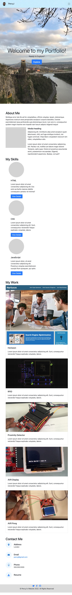

# Bootstrap-Portfolio
## Using Bootstrap to style my Portfolio

This challenge demonstrates the usage of bootstrap to style a webpage. It showcases the benefits of Bootstrap in speedy UI/UX design.

# Challenges

The main challenge was getting used to using the bootstrap classes instead of normal CSS styling.

# Things I learned

I learnt how bootstrap can speed up web design to enable more focus on funtionality. I learnt how to use font awesome to generate a myriad of icons! I also learnt how to use "!important" to override defualt properties in Bootstrap.

# Website Screenshot

## Fullsize

## Media Query in effect:

# Installation

N/A

# Usage

To use this [Portfolio Website](https://percyjacks.github.io/Bootstrap-Portfolio/), you can click the sections in the navigation bar and it will take you to the corresponding section on the website. (Note clicking dowload icon next to Resume will download a pdf.)

# Credits

N/A

# License

Please refer to the LICENSE in the repo.

# Contact

If you have any questions, please contact me at:

Github: [PercyJacks](https://github.com/PercyJacks)
